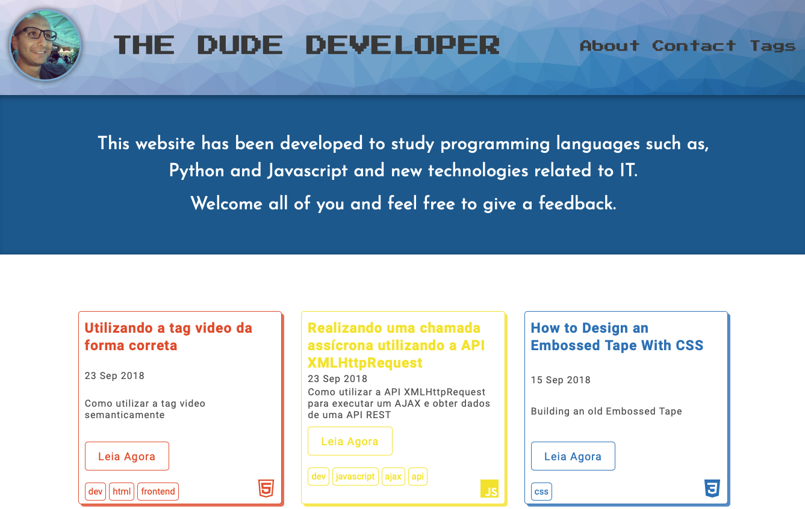
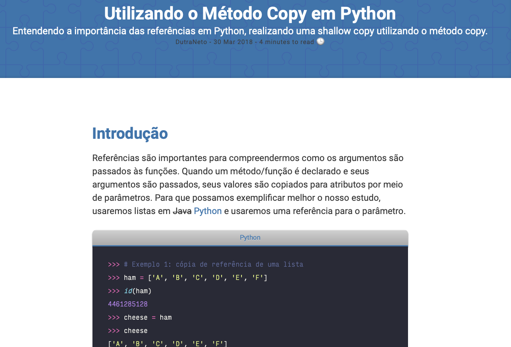
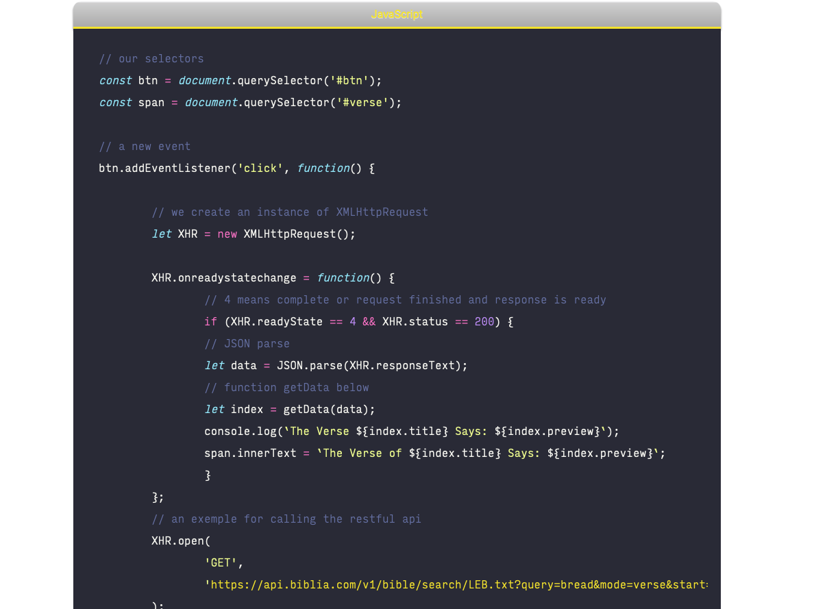
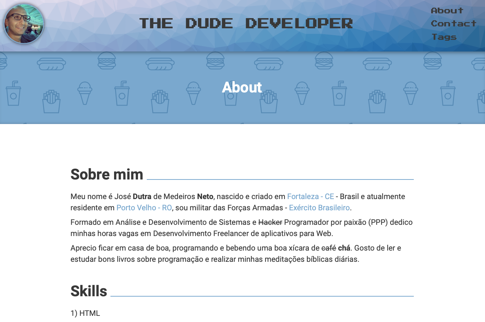
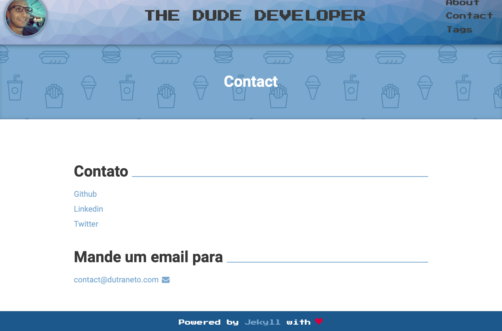
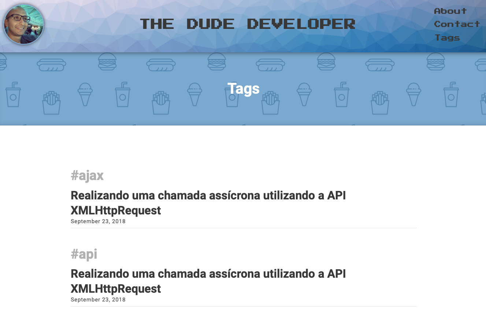

# Personal Blog

## My personal BLOG

### Front-end

-   HTML
-   JavaScript
-   CSS & SASS
-   Responsive Design
-   Ruby and Jekyll

---

### npm dev-dependencies

-   browser-sync
-   del
-   gulp
-   gulp-shell
-   lodash

---

### gemfile dependencies

-   pygments

-   jekyll

-   jekyll-autoprefixer

-   jekyll-minifier

---

## Live Demo

### https://dutraneto.com

---

### Screenshots

### TODO

🔘 Create a PT-BR to EN language switching

🔘 Create a nigth mode vision switching

🔘 Create a integration to Travis
